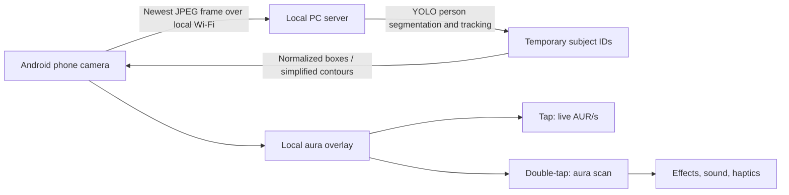

# AUR/S — TinkerHub Documentation Source

**Audience:** AI agents and implementers; this is source material for the future public project website and submission page.  
**Current stage:** Public-artifact Stage 0 — the website, screenshots, demo video, team details, and polished run instructions do not exist yet. The local Android/PC prototype now has a working transport, vision metadata loop, and baseline subject overlay.
**Purpose:** Preserves the TinkerHub-facing narrative and tracks the public artifacts that must be added after implementation.  
**Update this file when:** a public artifact exists, the project behavior changes, or submission information becomes known. Do not replace `TBD` with guesses.

---

# AUR/S — Human Aura Radiation Monitor 🎯

> A completely unscientific camera-powered instrument that assigns dramatic, imaginary aura radiation readings to people in a crowd.

**Project status:** documented concept / pre-build

## Basic Details

### Team Name

`TBD`

### Team Members

- Team lead: `TBD` — `TBD`
- Member: `TBD` — `TBD`
- Member: `TBD` — `TBD`

### Project Description

AUR/S turns an Android phone into a ridiculous handheld aura scanner. Point it at a crowd and the phone identifies up to six temporary subjects, gives each one a colourful aura field, and displays their live imaginary radiation rate in `AUR/s`.

Tap a person to lock the scanner on them. Double-tap to run a theatrical aura scan that may reveal a blessing, a curse, a suspiciously specific number, or a full aura singularity. The camera helps the effect follow people; it does not measure anything about them.

### The Problem (that doesn't exist)

People walk around every day without knowing whether their aura is quietly radioactive, absurdly powerful, or dangerously void-adjacent. Existing science has shown no urgency whatsoever in solving this.

### The Solution (that nobody asked for)

We are building a portable pseudo-scientific detector that uses real-time person segmentation only to locate people, then makes up the important aura facts with confidence, neon particles, Geiger clicks, and wildly authoritative labels.

## What the Experience Looks Like

```text
Open the app → point at people → subjects receive temporary IDs and auras
                                  ↓
                         tap a subject to monitor AUR/s
                                  ↓
                         double-tap for the dramatic scan
                                  ↓
                 receive an unverified blessing, curse, or anomaly
```

Example scan result:

```text
SUBJECT 04
LIVE FIELD: 18,472 AUR/s

INSTANT AURA:       +742 AUR
RANDOM BLESSING:    +250 AUR
FINAL AURA:          +992 AUR
CLASSIFICATION:      RADIANT
```

Possible special outcomes include recognisable milestones such as `69`, `420`, `1337`, `6969`, and `67,696,969`, plus `+∞` and `-∞` aura events.

## Technical Details

### Technologies / Components Used

#### Software

- **Android client:** Kotlin, Jetpack Compose, CameraX, Canvas-based overlay rendering
- **Local inference server:** Python, FastAPI, WebSocket, OpenCV, NumPy
- **Vision:** Ultralytics YOLO instance segmentation and multi-person tracking
- **Acceleration target:** NVIDIA TensorRT FP16 on an RTX 4060 PC
- **Feedback:** Android sound and haptic APIs

#### Hardware

- Android phone with camera
- Local Wi-Fi network
- PC with an NVIDIA RTX 4060 GPU for inference

### How It Works



1. CameraX provides the phone's live preview and sends only the newest compressed camera frame to the PC.
2. The PC detects and tracks people, returning up to six temporary subject IDs and their normalized locations.
3. Each new track receives one random but stable aura profile for as long as it stays visible.
4. The phone renders the aura locally, so the visuals remain responsive and no processed video has to travel back across Wi-Fi.
5. Selection, scan outcomes, effects, sound, and haptics happen on the phone.

### Intentional Constraints

- No face recognition, names, or permanent identity.
- No camera-frame recording or cloud upload.
- No claim that aura values are real measurements.
- One phone, one local PC, and at most six fully rendered subjects.
- The first version prioritizes a current, responsive overlay over maximum FPS.

## Project Documentation

### Design Direction

The interface is a playful neon instrument panel: dark background, thick glowing outlines, fake scientific labels, scan lines, and oversized monospace measurements. It should look like a sci-fi gadget taking itself much more seriously than anyone else does.

Every detected subject has an aura before they are selected. Selecting one makes their field brighter and reveals a live reading. A scan result changes the aura with an appropriately melodramatic visual treatment:

| Result | Intended reaction |
|---|---|
| Small positive | Warm gold/green glow and a soft confirmation chime |
| Large positive | Bright bloom and rising particles |
| Negative | Purple/blue distortion and warning tone |
| Milestone number | Special number reveal and celebratory effect |
| `+∞` | White-hot overexposure: `AURA OVERFLOW` |
| `-∞` | Dark vortex: `NEGATIVE AURA SINGULARITY` |

### Screenshots

Screenshots will be added once the live Android prototype exists:

1. Camera view with multiple temporary subject IDs and aura fields.
2. Selected-subject view showing a live `AUR/s` reading.
3. Completed scan result showing the base aura, modifier, final result, and effect.

### Planning Documents

- [Product plan](aura-radiation-monitor-plan.md) — experience, feature boundaries, model choice, and visual language.
- [Build guide](AURA_DETECTOR_BUILD_GUIDE.md) — phased implementation plan, performance targets, test plan, and event checklist.

## Installation and Run Instructions

The project is not implemented yet, so there are no truthful installation or run commands to publish. This section will be updated with the Android build steps, local server setup, required model assets, and LAN connection instructions when the first working vertical slice exists.

## Project Demo

### Video

`TBD — add a short demo video after the live camera-to-overlay loop works.`

### Live Website

`TBD — deploy the documentation website and place its public URL here before submission.`

### What the Demo Will Show

1. The phone connects to the local inference PC.
2. A small group receives stable temporary subject IDs and aura fields.
3. One person is selected and receives a fluctuating `AUR/s` reading.
4. A double-tap produces a dramatic fake aura result and matching effect.
5. The app handles a brief Wi-Fi interruption honestly by showing a degraded link state.

## Team Contributions

`TBD — update with each maker's specific contribution before submission.`

## Safety, Privacy, and the Bit

This project is a joke instrument, not a health, personality, spirituality, or biometric assessment tool. It processes live video only on the local demo network for temporary person positioning. It does not recognize faces, save footage, identify people, or infer attributes about them.

The best possible outcome is that someone gets labelled `SUSPICIOUSLY NORMAL`, everyone laughs, and the aura scanner remains as scientifically useless as intended.

---

Made with ❤️ for TinkerHub Useless Projects 3.0
