# Technical Requirements Document — AUR/S

**Status:** Draft v0.1  
**Scope:** Local-network Android demo MVP

## AI Maintenance Context

**Purpose:** Defines the intended technical shape so implementation choices remain compatible end to end.  
**Current stage:** Step 8 Android overlay, selection, local aura-core/scan logic, and feedback are implemented in the build. The authorized phone held a live link through frame 130 after the CameraX transform guard; full scan, audio/haptic, landscape, and performance acceptance remain. The PyTorch `yolo26n-seg.pt` baseline is selected; TensorRT remains deferred pending measurement.
**Update this file when:** the actual architecture, owned state, dependencies, deployment shape, configuration, or failure behavior differs from this design. Record measured facts, not guesses.

## 1. Architecture

```mermaid
flowchart LR
    C[Android CameraX preview] --> A[Latest-frame JPEG sender]
    A -->|WebSocket + session token| W[Python WebSocket server]
    W --> Q[Single newest-frame slot]
    Q --> V[YOLO person segmentation + tracker]
    V --> P[Track/profile state]
    P -->|frame_state JSON| O[Android overlay renderer]
    O --> U[Selection, scan, audio, haptics]
```

The phone always renders its local preview. The PC never returns processed video—only compact metadata. Each boundary retains at most one frame so latency cannot grow from queued work.

## 2. Components and Responsibilities

| Component | Responsibility | Does not do |
|---|---|---|
| Android camera | Preview and latest-frame JPEG creation | Detection or server-side tracking |
| Android socket client | Connection, token, frame ID order, reconnect | Queuing historical frames |
| Android overlay | Coordinate transform, rendering, hit-testing, effects | Person identity or inference |
| Android aura engine | Live-value animation, scan result, formatter | Network synchronization per digit |
| Python service | Health endpoint, WebSocket session, metrics | Persistent account management |
| Vision pipeline | Decode, person-only segmentation, tracking, contour simplification | Face recognition or storage |
| Track/profile store | Temporary track lifecycle and profile assignment | Database persistence |

## 3. Technology Baseline

- **Client:** Kotlin, Jetpack Compose, CameraX, a custom Canvas/View layer, OkHttp WebSocket.
- **Server:** Python 3.11+, FastAPI/Uvicorn, OpenCV, NumPy, Ultralytics.
- **Inference:** `yolo26n-seg.pt` baseline; BoT-SORT with ReID disabled; COCO class `person` only.
- **Target acceleration:** fixed-shape 640×640 TensorRT FP16 engine on the demo RTX 4060, only after baseline correctness is measured.

### Step 4 model baseline

Start with `yolo26n-seg.pt`: the nano instance-segmentation checkpoint is the fastest correctness baseline and supplies the person masks needed by the aura overlay. Configure `imgsz=640`, `classes=[0]`, `tracker="botsort.yaml"`, and `device=0` on the RTX 4060. Keep `yolo26s-seg.pt` as the quality candidate to benchmark only after the `n-seg` pipeline is correct. Final model selection remains measurement-driven and must meet NFR-01 and NFR-02.

## 4. Data and State

### Connection state

`CONNECTING → OK → DEGRADED → OFFLINE`

- `OK`: a current response arrives inside the freshness threshold.
- `DEGRADED`: connection exists but the last accepted metadata is older than the freshness threshold.
- `OFFLINE`: socket is closed or reconnect attempts fail.

### Subject state

`candidate → confirmed → lost-grace → expired`

- Confirm after 3 consecutive detections.
- Retain a lost track for roughly 1 second, fading its overlay.
- Delete profile and selection when the track expires.

### Frame policy

- Client capture: CameraX `STRATEGY_KEEP_ONLY_LATEST`.
- Network sender: one in-flight frame and one replaceable pending frame at most.
- Server: one replaceable newest decoded frame awaiting inference.
- Client renderer: accept only a `frame_state` newer than its last accepted `frameId`.

### Current implementation evidence

- Android source requests camera permission, configures CameraX `STRATEGY_KEEP_ONLY_LATEST`, downsamples YUV frames to a maximum 640-pixel long edge before JPEG encoding, caps sends at 15 FPS, and allows one outstanding frame.
- Android source sends v1 `hello`/`frame` messages, stores the session token locally, and displays hello/frame-state link status and round-trip latency.
- Python source accepts the v1 endpoint, validates hello/token/frame ordering, decodes JPEGs, runs the loaded YOLO segmentation/tracking model, filters class `person`, caps six subjects, simplifies contours, and returns normalized `frame_state` metadata.
- The server loads `yolo26n-seg.pt` once at startup, warms it once, auto-selects CUDA device 0 when PyTorch CUDA is available, and falls back to CPU. The current development environment reported CPU-only PyTorch, so GPU performance is not yet measured.
- `gradle :app:assembleDebug` has now passed on the development machine.
- The debug APK has been installed and the camera preview works over a private Windows hotspot; the college captive-portal network is not a supported transport network.
- The physical phone now receives `frame_state` acknowledgements from the YOLO server over the hotspot. The final shared-viewport/crop/rotation path reached `FRAME: 27` at 350 ms without a camera-process crash or CameraX viewport-mismatch warning; an earlier un-cropped path reached `FRAME: 17` at 315 ms. Both are smoke-test observations, not p50/p95 performance results.
- Android binds preview and analysis through one CameraX `UseCaseGroup`/`PreviewView` viewport, encodes the analysis crop after applying its rotation, and applies that same rotation in CameraX's per-frame source-to-`PreviewView` transform before rendering normalized boxes/contours into a Canvas overlay. It renders a temporary `SUBJECT #id` label; physical alignment is still unmeasured.
- Android projects the same geometry used for drawing into contour/box hit regions; a tap selects one track, highlights its outline, shows `SELECTED: #id`, and clears selection when the current frame no longer contains that ID.
- Android parses each server `profile` and runs a phone-local bounded random walk only for the selected track. Finite bands stay within their declared minimum/maximum; the named `∞` band is displayed as `∞ AUR/s` without floating-point arithmetic or network updates.
- Android handles selected-track double-tap locally: a 1-second scanning state transitions to a result card with signed base, blessing/curse modifier, final value, and classification; `+∞`/`−∞` are named states rather than arithmetic operands.
- Scan feedback stays on the phone: the safe-centered card pulses only when Android animations are enabled, `ToneGenerator` supplies an optional cue, `VibrationEffect` supplies short haptics, and a visible session mute control disables sound without hiding visual information.

## 5. Data Boundaries

- Source image pixels exist only in transit and working memory; no frame persistence.
- Server response contains frame ID, timing, temporary track ID, confidence, normalized box, optional simplified contour, and first-seen profile.
- All visual/anomaly outputs are client-generated fictional content.
- Timestamp telemetry contains no user identifier or image content.

## 6. Configuration

Keep the first configuration surface small:

| Key | Initial value |
|---|---:|
| Input JPEG size | Maximum 640-pixel long edge; aspect ratio preserved |
| JPEG quality | 70 |
| Send cap | 12–15 FPS |
| Inference size | 640×640 |
| Maximum subjects | 6 |
| Confirmation frames | 3 |
| Lost-track grace | 1 second |
| Metadata target | <20 KB/frame |

Configuration is local development configuration, not a remote-admin feature.

## 7. Reliability and Failure Behavior

- Drop old frames rather than delay new ones.
- Return a structured protocol error for invalid messages; keep the service process alive.
- Client backs off reconnect attempts and exposes the state in the HUD.
- Warm the selected model once at startup; health reports `ready` only after it can infer.
- On model failure, server returns `server_unavailable`; client retains preview and disables live claims.

## 8. Dependencies and Constraints

- Both devices must share a private local network that permits peer-to-peer traffic; captive-portal/public Wi-Fi is not supported.
- The target Android device must support CameraX and the selected minimum SDK.
- NVIDIA/CUDA/TensorRT versions must be tested together on the actual demo PC.
- Internet access is not needed during the demo after model artifacts are prepared.
