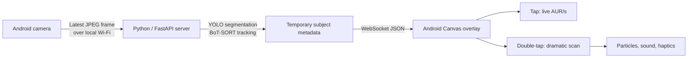

> AUR/S does **not** measure aura, health, emotion, personality, or any real human characteristic. The camera is used only to position visual effects around temporarily visible people.

# Aura Detector 🎯

## Basic Details

### Team Name

`SON?`

### Team Members

`Arjun Krishna K S`
`Aswath Krishna M B`

### The Problem (that doesn't exist)

People are walking around every day with unknown levels of imaginary aura radiation. Existing science has not identified this as a problem, which is exactly why it needs a neon instrument panel and Geiger clicks.

### The Solution (that nobody asked for)

AUR/S uses local real-time person segmentation to place a dramatic fake-science interface over up to six people. It tracks positions only; the important aura facts are made up locally with great confidence.

## What It Does

1. An Android phone captures its camera preview and sends only the newest compressed frame to a PC on the same private network.
2. The PC uses YOLO person segmentation and BoT-SORT tracking to return temporary IDs, boxes, and simplified contours for up to six people.
3. The phone renders the aura overlay, lets the user select a subject, and animates an in-band fictional `AUR/s` value.
4. A double-tap starts a one-second local scan with visual pulses, optional sound/haptics, and deliberately absurd outcomes, including named `+∞` and `−∞` events.



## Technologies Used

### Software

- **Android app:** Kotlin, Jetpack Compose, CameraX, OkHttp, DataStore
- **Local server:** Python 3.11+, FastAPI, Uvicorn, WebSockets, Pydantic
- **Vision:** Ultralytics YOLO instance segmentation, BoT-SORT tracking, OpenCV, NumPy
- **Effects:** Android Canvas, animation, audio, and haptic APIs

### Hardware

- Android phone running Android 8.0/API 26 or newer, with a camera
- PC on the same private Wi-Fi or hotspot network
- NVIDIA-capable PC is recommended for responsive live inference; the server falls back to CPU when CUDA is unavailable

## Project Structure

```text
Aura_Detector/
├── android/AuraDetector/  # Android Studio project
├── server/                # FastAPI WebSocket server and vision pipeline
├── docs/                  # Product, protocol, UX, testing, and operations docs
├── AURA_DETECTOR_BUILD_GUIDE.md
└── USELESS_PROJECTS_DOCUMENTATION.md
```

## Run Locally

### 1. Start the local inference server

Use PowerShell from the repository root:

```powershell
cd Aura_Detector
py -3.11 -m venv server/.venv
server/.venv/Scripts/Activate.ps1
python -m pip install --upgrade pip
pip install -r server/requirements.txt
python -m uvicorn server.app:app --host 0.0.0.0 --port 8765
```

The server prints a short-lived session token at startup. Keep it handy; the Android app needs it to connect. On its first run, Ultralytics may download the default `yolo26n-seg.pt` checkpoint. You can point to a local checkpoint or select a device with `AURA_MODEL_PATH` and `AURA_DEVICE` environment variables.

Confirm the server is reachable from the phone's network:

```text
http://<PC-LAN-IP>:8765/health
```

Use a private hotspot or LAN where the phone can reach the PC. Allow port `8765` through the PC firewall on **Private** networks only; do not expose this server to the internet.

### 2. Build and install the Android app

Open `Aura_Detector/android/AuraDetector` in Android Studio, connect a physical Android device, and run the `app` configuration. This fork currently does not include the Gradle wrapper launchers, so use Android Studio or a compatible locally installed Gradle distribution for command-line builds.

Install the generated debug APK on the phone, grant camera permission, then enter:

- **Server IP address:** the PC's private-network IP, without `http://`
- **Session token:** the token printed by the server
- **Port:** `8765` unless you started the server with another port

Use **Test Connection**, wait for `LINK: OK`, then tap **Connect**.

### 3. Run the tests

With the server environment activated and the current directory set to `Aura_Detector`:

```powershell
python -m pytest server/tests -q
```

## Current Status

The source includes a functioning vertical slice: local server health checks and WebSocket authentication, latest-frame camera transport, YOLO person metadata, a camera overlay, tap selection, local aura-value animation, local scan logic, and sound/mute/haptic implementation.

It is still at its final stage after prototype ready for judgement. It is not a deployed consumer app or a scientific measurement tool.

## Privacy and Safety

- No face recognition, names, or persistent identity.
- No cloud upload or camera-frame recording in the intended demo flow.
- Only temporary person-position metadata is returned to the phone.
- The server accepts one client at a time and requires a newly generated token for each server process.
- Aura readings are fictional entertainment effects, never biometric or medical assessments.

## Documentation

- [Build guide](Aura_Detector/AURA_DETECTOR_BUILD_GUIDE.md)
- [TinkerHub submission source](Aura_Detector/USELESS_PROJECTS_DOCUMENTATION.md)
- [Product requirements](Aura_Detector/docs/PRD.md)
- [Technical requirements](Aura_Detector/docs/TRD.md)
- [WebSocket protocol](Aura_Detector/docs/WEBSOCKET_PROTOCOL.md)
- [Testing and acceptance](Aura_Detector/docs/TEST_AND_ACCEPTANCE.md)
- [Security, privacy, and operations](Aura_Detector/docs/SECURITY_PRIVACY_OPERATIONS.md)

## Demo and Screenshots


---

Made with ❤️ at TinkerHub Useless Projects


